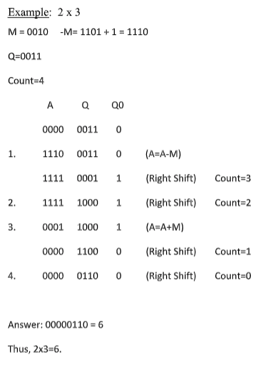
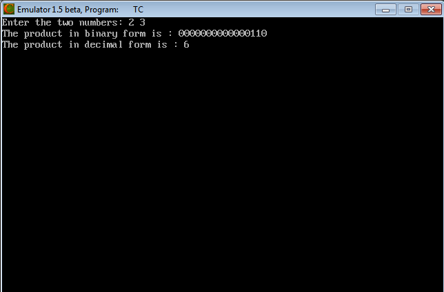

## Booth's Multiplication Algorithm

-----------------------------------------
### Problem Definition:
Write a program to implement Booth's Multiplication Algorithm.

    

------------------------------------------
### Output:

    

