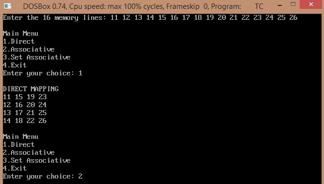
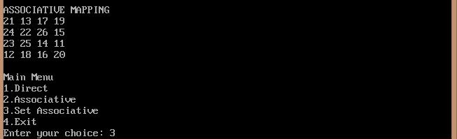
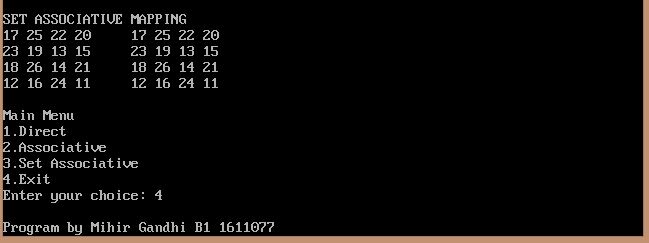

## Cache Mapping

-----------------------------------------
### Problem Definition:
Write a program to implement the following Cache Mapping techniques:
1. Direct mapping
2. Associative mapping
3. Set Associative mapping

------------------------------------------
### Output:

    

    

    

