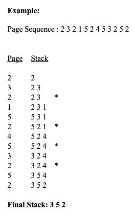
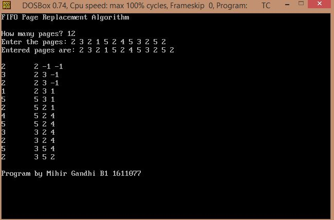

## FIFO Page Replacement

-----------------------------------------
### Problem Definition:
Write a program to implement FIFO Page Replacement Algorithm. The FIFO algorithm uses the principle that the block in the set which has been in for the longest time will be replaced. 

    

------------------------------------------
### Output:

    

