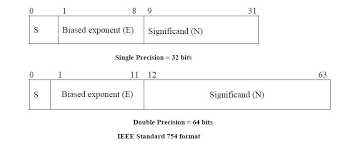
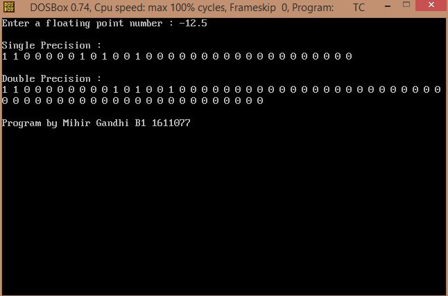
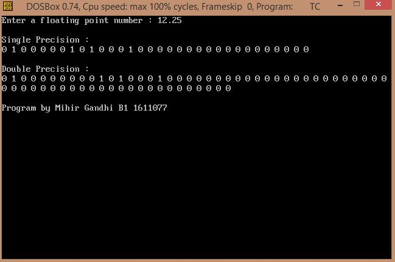

## IEEE 754 Floating Point Representation

-----------------------------------------
### Problem Definition:
Write a program to demonstrate the IEEE 754 single and double precision formats to represent floating point numbers.

    

------------------------------------------
### Output:

    

    

