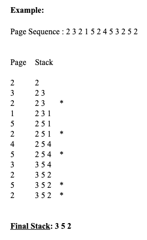
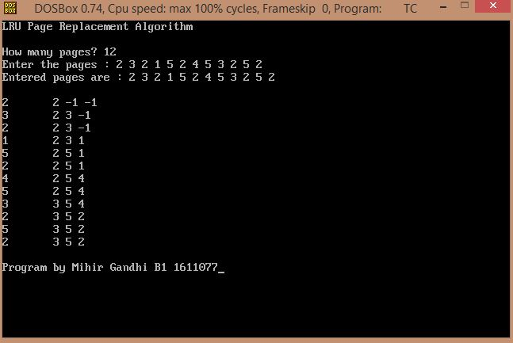

## LRU Page Replacement Algorithm

-----------------------------------------
### Problem Definition:
Write a program to implement LRU Page Replacement Algorithm. The LRU algorithm replaces the least recently used memory block i.e. the memory block that has not been accessed by the user for the longest duration. 

    

------------------------------------------
### Output:

    

