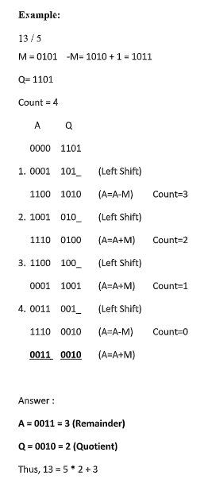
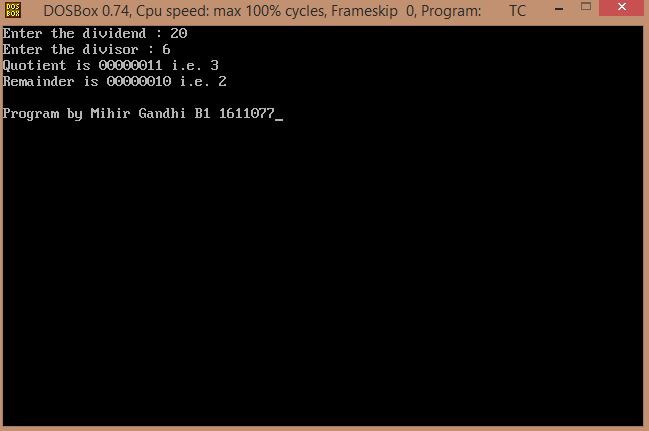

## Non-restoring Division

-----------------------------------------
### Problem Definition:
Write a program to implement Non-restoring Method of Division.

    

------------------------------------------
### Output:

    

