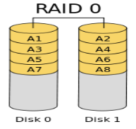
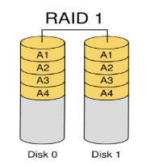
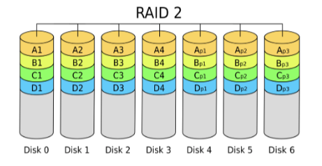
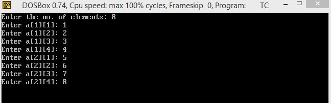
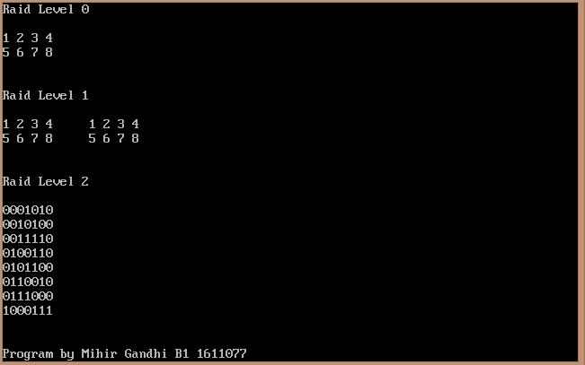

## RAID Levels

-----------------------------------------
### Problem Definition:
Write a program to demonstrate RAID levels 0, 1, and 2. 

RAID, short for Redundant Array of Independent Disks, are a category of disk drives that employ two or more drives in combination for fault tolerance and performance.

1. A RAID 0 (also known as a stripe set or striped volume) splits data evenly across two or more disks (striped) with no parity information for redundancy.

    

2. A RAID 1 creates an exact copy (or mirror) of a set of data on two or more disks. 

    

3. A RAID 2 stripes data at the bit (rather than block) level, and uses a Hamming code for error correction. 

    

------------------------------------------
### Output:

    

    

