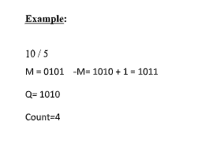
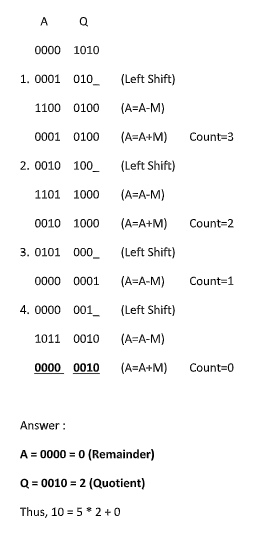
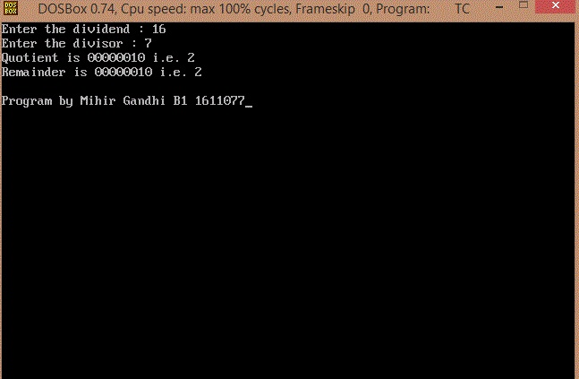

## Restoring Division

-----------------------------------------
### Problem Definition:
Write a program to implement Restoring Method of Division.

    

    

------------------------------------------
### Output:

    

